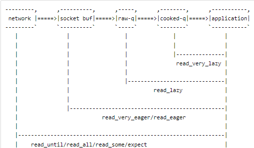

# Telnetlib Documentation

## Overview

- **Background:** Telnet is a protocol used for interactive communication with remote computers. It was developed in 1969 and is based on the Telnet protocol, defined in RFC 854. Telnetlib is a Python library that provides a simple interface for creating Telnet clients and automating interactions with Telnet servers. 
- **Control Characters and Sequences:** The Telnet protocol defines a set of control characters and sequences, such as the Interpret As Command (IAC) sequence and the Subnegotiation (SB/SE) sequence, among others. For example, an IAC sequence may indicate the start of a Telnet command, while an SB/SE sequence may indicate the beginning and end of a subnegotiation process for a Telnet option. telnetlib abstracts away the details of handling Telnet control characters and sequences from the user. Internally, telnetlib takes care of parsing incoming data from the Telnet server, identifying and processing Telnet control characters and sequences, and ensuring that the data is presented to the user in a usable format (e.g., as byte strings or decoded Unicode strings).
- **Bytes:** In Python, strings prefixed with b indicate that they are "bytes" objects rather than "str" (Unicode) objects. This distinction is important when working with binary data, as bytes objects represent sequences of raw 8-bit values, while str objects represent Unicode text. When interacting with Telnet servers using the telnetlib library in Python, you often need to send and receive data in byte form. Prefixing strings with b allows you to specify that the data should be treated as bytes rather than Unicode text. This is important because Telnet communications often involve sending and receiving binary data (e.g., Telnet control sequences, binary file contents), which must be transmitted in their raw byte form. 



## Buffers: Cooked vs Raw
- **Note:** The size of both the raw and cooked buffer is typically limited by the underlying operating system's socket buffer size. If the buffer receives more data than it can handle, the operating system's networking stack may drop or discard excess data, potentially leading to a loss of information.

### Cooked Buffer
- **Description:** Contains processed data after Telnet negotiation and interpretation. Telnet control characters and sequences are translated into meaningful actions.
- **Difference:** Interpreted Telnet control characters and sequences.
- **Cleared by Methods:** `read_until`, `read_all`, `read_some`, `read_very_eager`, `read_eager`, `read_lazy`, `read_very_lazy`, `read_sb_data`, `expect`

### Raw Buffer
- **Description:** Contains raw data received from the Telnet server, including Telnet control characters and binary data.
- **Difference:** Raw byte data without interpretation.
- **Cleared by Methods:** None

## Telnetlib Commands

The following method descriptions come from the [official telnetlib documentation](https://docs.python.org/3/library/telnetlib.html).

### Telnet.open(host, port=0[, timeout])
Connect to a host.

### Telnet.read_until(expected, timeout=None)
Read until a given byte string, expected, is encountered or until timeout seconds have passed.

### Telnet.read_all()
Read all data until EOF as bytes.

### Telnet.read_some()
Read at least one byte of cooked data unless EOF is hit. Return b'' if EOF is hit.

### Telnet.read_very_eager()
Read everything that can be without blocking in I/O (eager).

### Telnet.read_eager()
Read readily available data.

### Telnet.read_lazy()
Process and return data already in the queues (lazy).

### Telnet.read_very_lazy()
Return any data available in the cooked queue (very lazy).

### Telnet.read_sb_data()
Return the data collected between a SB/SE pair (suboption begin/end).

### Telnet.write(buffer)
Write a byte string to the socket, doubling any IAC characters. May raise OSError if the connection is closed.

### Telnet.close()
Close the connection.

### Telnet.get_socket()
Return the socket object used internally.

### Telnet.fileno()
Return the file descriptor of the socket object used internally.

### Telnet.interact()
Interaction function, emulates a very dumb Telnet client.

### Telnet.mt_interact()
Multithreaded version of interact().

### Telnet.expect(list, timeout=None)
Read until one from a list of a regular expressions matches.

## Example

Here's an example of how to use telnetlib to connect to a Telnet server and send commands:

```python
import telnetlib
import getpass

HOST = "127.0.0.1"  # Loopback address
PORT = 23           # Telnet port

# Username and password for authentication
# USER = input("Enter your username: ") # input is blocking
# PASSWORD = getpass.getpass("Enter your password: ") # getpass is blocking

# Connect to the Telnet server
with telnetlib.Telnet(HOST, PORT) as tn:
    # Uncomment the lines below for authentication
    # tn.read_until(b"Username: ")
    # tn.write(USER.encode("utf-8") + b"\n")
    # tn.read_until(b"Password: ")
    # tn.write(PASSWORD.encode("utf-8") + b"\n")
    
    # Send a command
    tn.write(b"ls\n")

    response = tn.read_until(b"prompt")
    
    # Print the response
    print(response.decode("utf-8"))
    
    '''
    read_very_lazy() returns nothing
    read_eager() splits lines
    read_very_eager() returns beatifully
    '''
